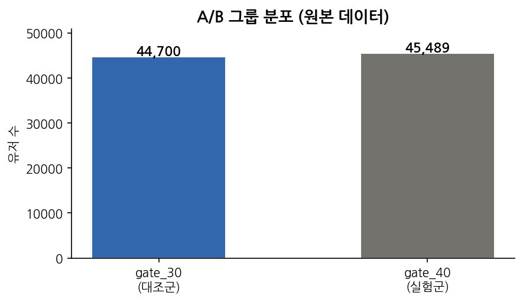
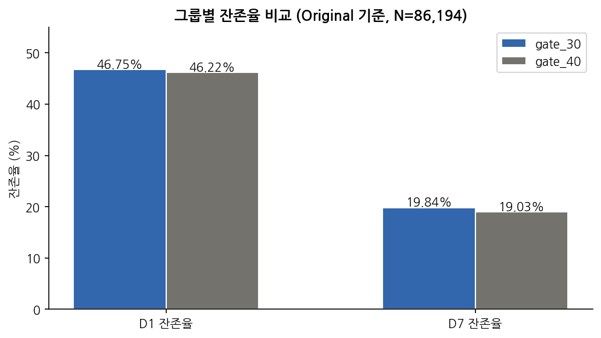
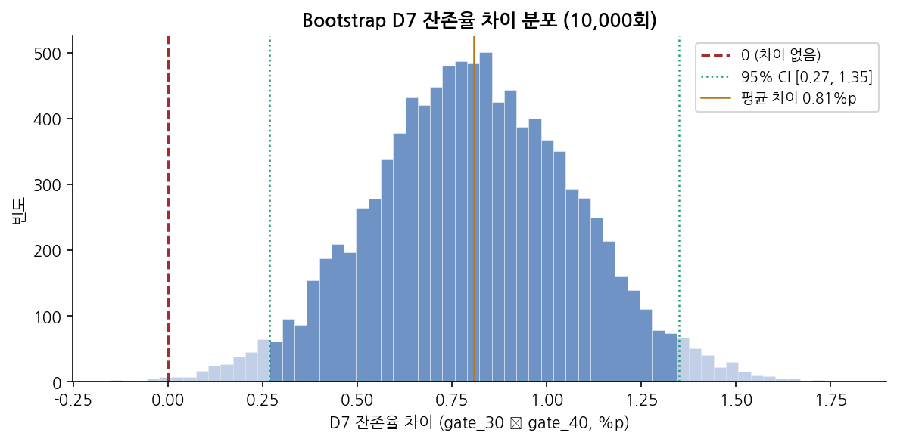
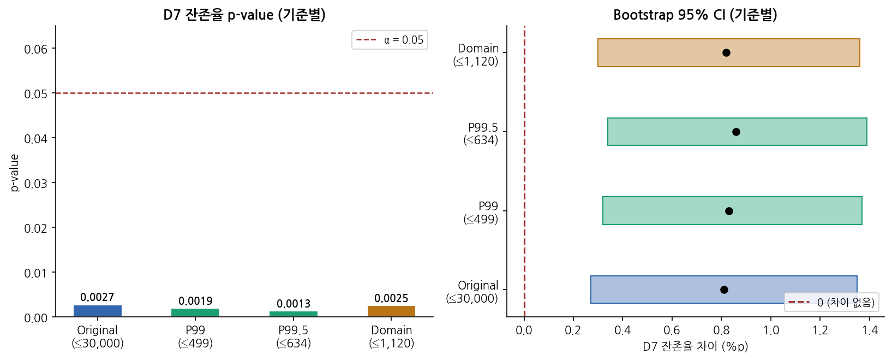
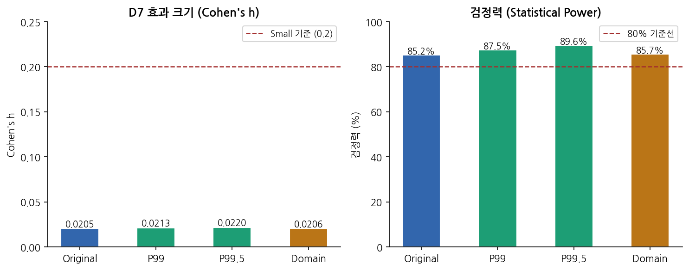
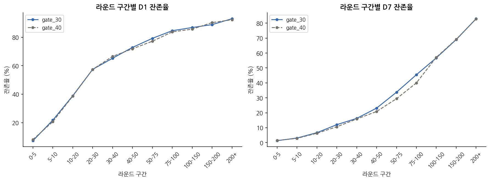

# Cookie Cats A/B 테스트 — Gate 위치가 유저 잔존율에 미치는 인과적 영향 분석

## 1. 프로젝트 개요 & 동기

### 왜 이 문제를 선택했는가?

Cookie Cats는 "connect-three" 스타일의 F2P 모바일 퍼즐 게임이다. 게임 내 **"Gate"**는 특정 레벨에서 유저에게 강제 대기를 부여하는 메커니즘으로, 수익화(인앱 구매 유도)와 세션 조절(피로감 방지 → 장기 잔존율 개선)의 두 가지 기능을 한다.

기획팀에서는 "Gate를 레벨 30에서 레벨 40으로 옮기면, 유저가 더 많은 콘텐츠를 먼저 경험하게 되어 잔존율이 높아지지 않을까?"라는 가설을 세웠다. 이 프로젝트는 90,189명의 실제 A/B 테스트 데이터를 사용하여 해당 가설을 통계적으로 검증하고, 게이트 위치에 대한 데이터 기반 의사결정을 내리는 것을 목표로 한다.

이 데이터셋을 선택한 이유는 다음과 같다:

- **인과 추론 연습에 이상적인 구조:** 무작위 배정된 A/B 테스트 데이터로, 관찰 연구에서 발생하는 교란 변수 문제 없이 인과적 해석이 가능하다.

### 핵심 질문

> **Gate를 레벨 30에서 레벨 40으로 옮기면 유저 리텐션이 증가할까, 감소할까?**

### 의사결정 프레임워크

| 구분 | 기준 |
|------|------|
| Primary KPI | D7 잔존율 차이 (gate_30 vs gate_40), p < 0.05 |
| Secondary KPI | D1 잔존율 차이, 게임 라운드 수 중앙값 차이 |
| 통계적 실패 | p > 0.05이거나 Bootstrap CI가 0 포함 → 차이가 우연일 가능성 |
| 실용적 실패 | 유의하더라도 효과 크기가 작으면 → 변경 비용 대비 실익 없음 |

---

## 2. 데이터 출처 & 전처리 과정

### 데이터 출처

| 항목 | 값 |
|------|-----|
| 출처 | [Kaggle - Cookie Cats A/B Testing](https://www.kaggle.com/datasets/yufengsui/mobile-games-ab-testing) |
| 원본 크기 | 90,189명 |
| 관찰 기간 | 설치 후 14일 |

| 컬럼 | 타입 | 설명 |
|------|------|------|
| `userid` | int | 고유 유저 ID |
| `version` | str | A/B 그룹 — `gate_30` (대조군) / `gate_40` (실험군) |
| `sum_gamerounds` | int | 설치 후 14일간 플레이한 총 라운드 수 |
| `retention_1` | bool | 설치 다음날 접속 여부 (D1 잔존율) |
| `retention_7` | bool | 설치 7일 후 접속 여부 (D7 잔존율) |

### 전처리 과정

```python
OUTLIER_UPPER = 30_000
df = df_raw[df_raw['sum_gamerounds'] <= OUTLIER_UPPER].copy()  # 극단 이상치 제거
df = df[df['sum_gamerounds'] > 0].copy()                       # 0라운드 유저 제거
# 최종: 86,194명
```

| 단계 | 제거 대상 | 제거 수 | 잔여 |
|------|----------|:-------:|:----:|
| 원본 | — | — | 90,189명 |
| 0라운드 제거 | 설치 후 미실행 유저 | 3,994명 | 86,195명 |
| 극단치 제거 | sum_gamerounds > 30,000 | 1명 | **86,194명** |

**중요:** 본 분석은 **ITT(Intention-To-Treat) 원칙**을 따른다. 게이트 도달 여부와 무관하게 배정된 전체 유저를 분석 대상으로 포함하여, 무작위 배정이 보장하는 인과적 해석력을 유지한다. 이에 대한 상세 논의는 report.md 8장을 참고한다.

---

## 3. 분석 방법 & 선택 이유

### 분석 파이프라인

```
Phase 1: EDA          →  Phase 2: 가설 검정      →  Phase 3: 민감도 분석    →  Phase 4: 인과 추론 논의
데이터 품질 확인          Chi-square 검정             이상치 기준 4가지           ITT vs Per-Protocol
A/B 그룹 균형 검증        Bootstrap 10,000회          변화시켜 강건성 검증        생존 편향 분석
분포 파악                Mann-Whitney U                                        인과적 해석 vs 상관 해석
잔존율 초기 비교          Cohen's h 효과 크기
                        검정력 분석
```

### 검정 방법 선택 이유

| 검정 | 대상 | 선택 이유 |
|------|------|----------|
| Chi-square | D1, D7 잔존율 | 이진(bool) 결과에 대한 두 그룹 비율 비교의 표준 방법 |
| Bootstrap (10,000회) | D1, D7 잔존율 | 분포 가정 없이 강건한 신뢰구간 추정. Chi-square의 모수적 가정을 보완 |
| Mann-Whitney U | 게임 라운드 | 극심한 우측 편중 분포에 t-test 부적합. 비모수 검정이 적절 |
| Cohen's h | D1, D7 잔존율 | 통계적 유의성과 별개로 실질적 효과 크기를 평가. 대규모 표본에서 중요 |

---

## 4. 핵심 결과

### 종합 판정

| KPI | 결과 | 판정 |
|-----|------|------|
| **D7 잔존율** (Primary) | gate_30이 +0.81%p 높음, p = 0.0027 | ✅ 유의 |
| D1 잔존율 | gate_30이 +0.54%p 높음, p = 0.116 | ❌ 유의하지 않음 |
| 게임 라운드 | 중앙값 동일 (18.0), p = 0.118 | ❌ 유의하지 않음 |
| 효과 크기 | Cohen's h = 0.02 (매우 작음) | ⚠️ 실질 효과 제한적 |
| 민감도 | 4가지 기준 모두 동일 결론 | ✅ 강건함 |

### 최종 권고: Gate 30 유지 (현행 유지)

D7 잔존율에서 gate_30이 통계적으로 유의하게 높다 (p = 0.0027). gate_40으로 변경 시 소폭 하락만 발생하며, 어떤 기준으로 분석해도 gate_40의 장점은 발견되지 않는다. 효과 크기가 극히 작으므로(0.81%p, Cohen's h = 0.02), 잔존율의 의미 있는 개선을 위해서는 게이트 위치가 아닌 다른 변수의 후속 실험을 설계하는 것을 권고한다.

### 주요 시각화

| 차트 | 설명 |
|------|------|
|  | A/B 그룹이 50:50으로 균형 잡혀 있음 |
|  | D7에서 gate_30이 일관되게 높음 |
|  | 95% CI가 0을 포함하지 않음 → 유의 |
|  | 4가지 이상치 기준 모두 동일 결론 |
|  | Cohen's h 매우 작으나 검정력 85%+ 충분 |
|  | 30~40라운드 구간에서 차이가 가장 두드러짐 |

### ITT vs Per-Protocol — 전처리에 따른 결론 역전

이 분석에서 가장 중요한 교훈은 전처리 방식에 따라 결론이 완전히 뒤집힌다는 것이다.

| 분석 유형 | D1 차이 | D7 차이 | 방향 |
|-----------|:------:|:------:|:----:|
| **ITT** (전체 유저) | +0.54%p | +0.81%p | **gate_30 우위** |
| **Per-Protocol** (게이트 통과 유저만) | −2.92%p | −4.63%p | **gate_40 우위 (뒤집힘!)** |

Per-Protocol 분석에서 gate_40이 우위로 나타나는 이유는 인과적 효과가 아니라 **생존 편향**이다. gate_40 통과율(31.8%)이 gate_30 통과율(38.9%)보다 낮아, gate_40 그룹에는 원래 더 열성적인 유저만 남기 때문이다. **인과적 해석은 ITT 기준 분석을 따라야 한다.** 상세 논의는 [`report.md` 8장](report.md#8-인과-추론-논의--itt-vs-per-protocol)을 참고한다.

---

## 5. 한계점 & 향후 개선 방향

- 데이터에 유저 인구통계(연령, 지역, 디바이스) 정보가 없어 세그먼트별 이질적 효과를 분석할 수 없었다.
- retention_1, retention_7만 제공되어 D2~D6의 잔존율 변화 곡선을 추적할 수 없다. 시계열적 잔존율 패턴을 파악하려면 일별 로그 데이터가 필요하다.
- 수익 데이터가 없어 잔존율 변화가 실제 매출에 미치는 영향을 정량화하지 못했다. LTV(Lifetime Value) 분석이 추가되면 의사결정의 설득력이 높아질 것이다.
- Gate 위치 30 vs 40 두 수준만 비교했다. 

---

## 6. 배운 점

- **"통계적으로 유의하다"와 "실질적으로 중요하다"는 별개라는 것을 체감했다.** p = 0.0027이라는 강한 유의성에도 Cohen's h = 0.02는 사실상 무시할 수 있는 크기다. 86,000명이라는 거대한 표본이 아주 작은 차이도 "유의하게" 만들어버린다.
- **전처리 하나로 결론이 정반대로 뒤집히는 경험.** "게이트를 경험한 유저만 분석하는 것이 더 정확하지 않을까?"라는 직관이 생존 편향이라는 함정을 만든다는 것을 배웠다. A/B 테스트에서는 ITT 원칙을 먼저 따르고, Per-Protocol은 탐색적 보조 분석으로만 활용해야 한다.
- **민감도 분석의 가치를 깨달았다.** 이상치 기준을 P99부터 30,000까지 바꿔가며 결론이 변하지 않음을 확인하는 과정이 "이 결과를 믿어도 되는가?"에 대한 확신을 준다.

---

## 프로젝트 구조

```
cookie_cats/
├── README.md                  ← 이 파일 (프로젝트 개요 & 핵심 결과)
├── report.md                  ← 전체 분석 보고서 (EDA → 가설검정 → 민감도 → 인과 추론)
├── CLAUDE.md                  ← Claude Code 안내 파일
├── data/
│   └── cookie_cats.csv        ← 원본 데이터 (90,189명)
├── notebooks/
│   └── 01_EDA.ipynb           ← 탐색적 데이터 분석 노트북
├── figures/
│   ├── 01_ab_distribution.png         ← A/B 그룹 분포
│   ├── 02_gamerounds_distribution.png ← 게임 라운드 분포 & 그룹별 boxplot
│   ├── 03_retention_comparison.png    ← D1/D7 잔존율 그룹 비교
│   ├── 04_bootstrap_d7.png            ← Bootstrap D7 차이 분포
│   ├── 05_sensitivity_analysis.png    ← 민감도 분석 (p-value & CI)
│   ├── 06_effect_size_power.png       ← 효과 크기 & 검정력 비교
│   └── 07_retention_by_rounds.png     ← 라운드 구간별 잔존율 패턴
├── pyproject.toml
└── uv.lock
```

## 기술 스택

- **언어:** Python 3.12
- **패키지 관리:** uv
- **분석:** pandas, numpy, scipy
- **시각화:** matplotlib, seaborn
- **노트북:** Jupyter (커널: `cookie-cats`)

## 상세 보고서

전체 분석 내용(EDA, 가설검정, 민감도 분석, ITT vs Per-Protocol 인과 추론 논의)은 [`report.md`](report.md)를 참고한다.

## Tools & AI 활용

본 프로젝트는 분석 과정에서 AI 도구(Claude,Copilot)를 활용했습니다.

- **활용 범위:** 통계 검정 코드 작성, 시각화 생성, 보고서 초안 작성, ITT vs Per-Protocol 논의 구조화
- **본인 기여:** 분석 프레임워크 설계, 의사결정 기준 수립, 전처리 기준 선정, 인과 추론 논의 방향 설정, 최종 해석 및 검토